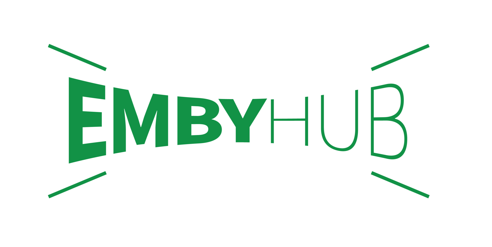

# Emby Hub 入门

<figure><figcaption></figcaption></figure>

## Emby是什么？

Emby是一个主从式架构的媒体服务器软件，可以用来整理服务器上的视频和音频，并将音频和视频流式传输到客户端设备。

简单来说：Emby是一个私有的流媒体播放平台，类似爱奇艺奈飞等。

## 关注消息

请关注TG用户群： [https://t.me/emby\_hub](https://t.me/emby\_hub)&#x20;

视频更新频道：[https://t.me/embyhub](https://t.me/embyhub)

18+更新频道： [https://t.me/nsfwembyhub](https://t.me/nsfwembyhub)

联系服主： [https://t.me/ednovas](https://t.me/ednovas)

## 注意事项

1. 禁止使用 Infuse
2. 禁止无意义水群，会/warn，3次/warn将踢出群组
3. 禁止群内散播色情/反动/政治内容，违者将直接踢出
4. 禁止在群内使用<mark style="background-color:red;">無名 Bot</mark> 指令，不存在的错误指令亦同

