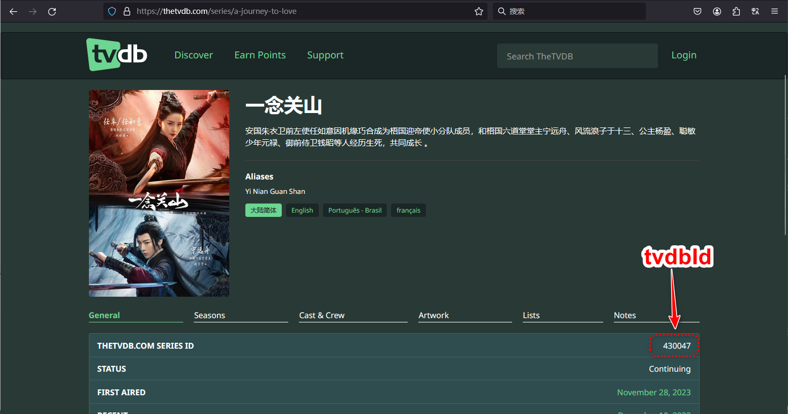
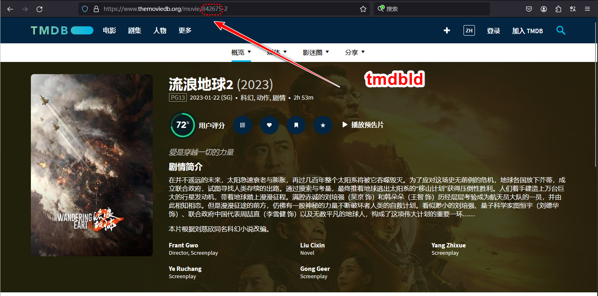

# Bot使用



/help 帮助

/signup 注册，需等待开放注册使用

/code 使用注册码或者续期码，注册码: 输入 /code + 注册码，将会注册。续期码: 输入 /code + 续期码,

> 注册码和续期码扣除生成者的积分后生成，有效期3个月，按一个月30天记。目前扣除的积分分别等同于注册积分和续期积分

/info 查看积分信息, 仅管理员可用

/me 查看 emby 账号信息，包含以下功能按钮：生成续期码注册码，NSFW开关，续期，查看续期积分，重置密码，线路查询，求片，上传字幕。

/checkin 签到，每天仅限签到一次。每签到7天后，第8天签到抽奖(一次)，可获得 积分翻倍(x2)、增加续期时间(1天、7天、15天)、续期码(1月)、注册码其中一种。没有Emby账户获得1天、7天、15天续期会等比兑换成积分

/warn 警告用户，仅管理员使用

> 用户使用管理员指令也会被警告(无消息通知)，每次警告会扣除与警告次数相等的积分，警告次数无法消除，仅累加。

服主处理后将会加入下载队列，预计1-2周内会更新到Emby Hub中

## 求片

用户使用 /me 指令，点击求片按钮，根据提示选择求片类型，再根据提示提供对应的ID

对于电影，请提供tmdbId，该ID在[https://www.themoviedb.org](https://www.themoviedb.org/)获取

对于剧集、动画，请提供tvdbId，该ID在[https://thetvdb.com](https://thetvdb.com/)获取

|类型|电影|剧集|动画|
|:--:|:--:|:--:|:--:|
||电影和动画电影/剧场版|真人电视剧/纪录片|动画剧集|
||[tmdb](https://www.themoviedb.org/)|[tvdb](https://thetvdb.com/)|[tvdb](https://thetvdb.com/)|

## 上传字幕

用户使用 /me 指令，点击上传字幕按钮，根据提示选择上传字幕的类型，再根据提示提供对应的ID

对于电影，请提供tmdbId，该ID在[https://www.themoviedb.org](https://www.themoviedb.org/)获取

> 电影字幕请按照 `电影名.字幕语言.后缀` 的格式重命名，比如 流浪地球.zh.ass，将字幕压缩成zip文件后按提示上传给 Bot  
> zip文件名请使用 `tmdbId`，例如 842675.zip

对于剧集、动画，请提供tvdbId，该ID在[https://thetvdb.com](https://thetvdb.com/)获取

> 剧集、动画字幕请按照 `S季E集.字幕语言.后缀` 的格式重命名，比如 一念关山第一季第二集是 S1E2.zh.ass，将所有字幕压缩成一个zip文件后按提示上传给 Bot  
> zip文件名请使用 `tvdbId`，例如 430047.zip

|类型|电影|剧集|动画|
|:--:|:--:|:--:|:--:|
||电影和动画电影/剧场版|真人电视剧/纪录片|动画剧集|
||[tmdb](https://www.themoviedb.org/)|[tvdb](https://thetvdb.com/)|[tvdb](https://thetvdb.com/)|

|字幕语言|简体中文|繁体中文|
|:--:|:--:|:--:|
||zh|zt|

  
