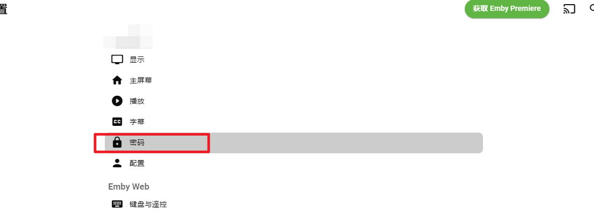

# 加入Emby Hub

## 注册账户方式

1. 抽奖，会在节日或随机时候开始抽奖活动，按照要求参与抽奖有机会获得注册邀请码
2. 公开注册，会不定时开放注册，每次开放注册至少10人以上
3. 和服主PY
4. 付费支持（暂未开放，短时间内不做付费考虑）
5. 积分注册，与保号所需积分等同

## 积分获取方式

由 @EdHubot 管理积分。目前积分获取方式为群组聊天，不设上限，群组整体活跃越高，结算时的总积分越高，个人活跃度越高，可分得的积分越多。每天北京时间8点和20点执行积分结算。维护机器人时可能提前结算。

## 续期条件

查看 <mark style="color:orange;background-color:orange;">保号要求</mark>

## 注册

假如您已经有注册码了，或者在公开注册期间，前往 [https://t.me/EdHubot](https://t.me/EdHubot) 使用机器人注册。

### 邀请码注册

1. /code + 邀请码, 例如 /code 1a2s3d4f
2. 然后登录EmbyHub输入对应的账户密码即可

### 公开注册

1. 公开注册期间，会在群组内置顶消息的，如 `注册已开放，本次共有30个名额 私聊 @EdHubot 发送 /signup 创建用户`
2. 前往 [https://t.me/EdHubot](https://t.me/EdHubot) 机器人注册
3. 输入`/signup`
4. 如果限制的注册名额满了将会无法注册

#### <mark style="color:white;background-color:black;">注意：在注册前确保私聊过 Bot，并且设置了Telegram 用户名，未达要求所造成的损失本服不负责</mark>

## 更改密码

登录后右上角选择`小人图标`，选择`应用程序设置`

.png>)

选择`密码` ，然后输入你的现有密码，以及需要更改为的密码。

如忘记密码，需要重置密码，请准备好账户注册记录证据并联系 [https://t.me/ednovas](https://t.me/ednovas)

